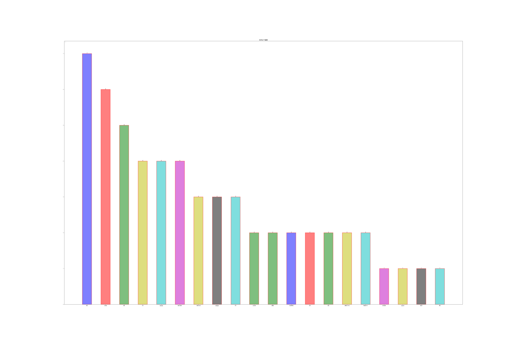
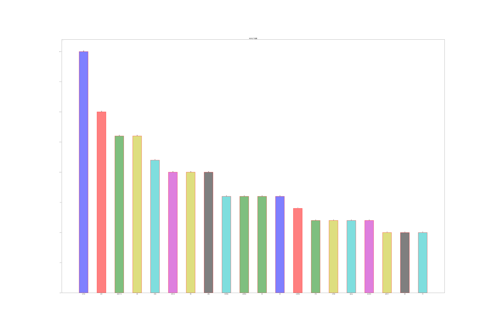

##### 在这里我爬取了胡润富豪榜的数据并且进行了简单分析

##### Quick start

```
1. Either install using pip  wait about some minintr:
    ```
    ```
python huarun.py
    ```


###### 统计四十岁以下的富豪的行业分布



###### 统计五十岁以下的富豪的行业分布 



